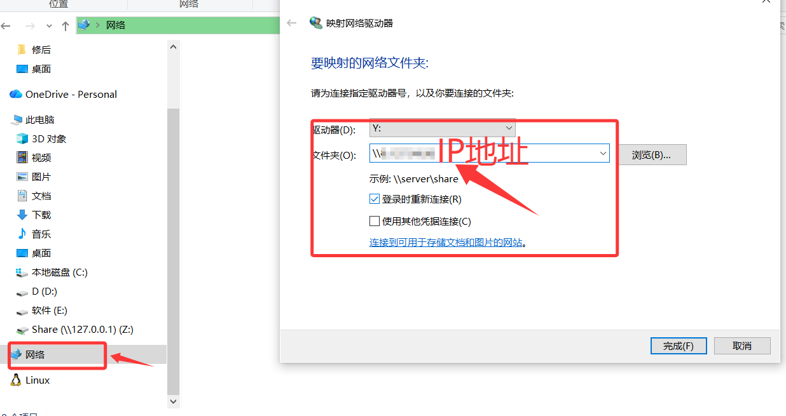
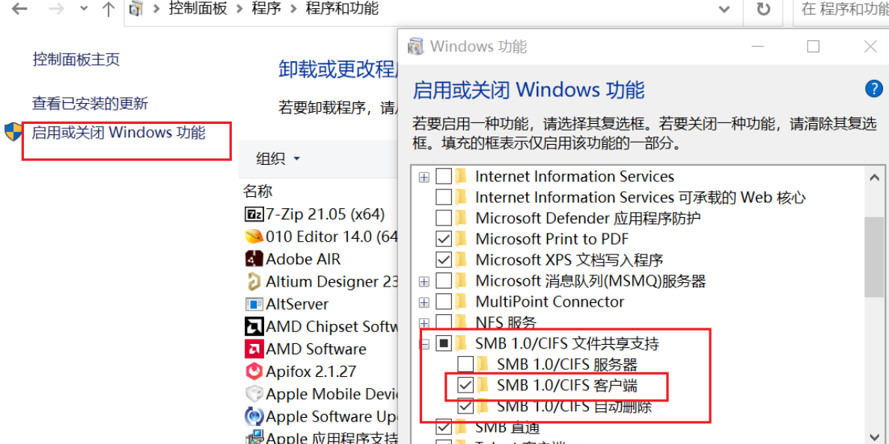

- [搭建Samba服务器](#搭建samba服务器)
  - [正常搭建Samba服务器步骤](#正常搭建samba服务器步骤)
    - [1、安装Samba服务器](#1安装samba服务器)
    - [2、配置需要共享的目录](#2配置需要共享的目录)
    - [3、添加Samba用户](#3添加samba用户)
    - [4、配置Samba 服务器](#4配置samba-服务器)
    - [5、启动Samba](#5启动samba)
    - [6、windows上面创建映射文件夹即可使用](#6windows上面创建映射文件夹即可使用)
  - [踩坑](#踩坑)
    - [1、阿里云服务器安全组未打开](#1阿里云服务器安全组未打开)
    - [2、Windows smb服务没打开](#2windows-smb服务没打开)
    - [3、重点注意！！！windows会把@当成域名解析](#3重点注意windows会把当成域名解析)
  - [致此，所有问题解决，映射网络驱动器（\\127.0.0.1\\Share）只是 多出一个盘符，对系统原有功能零影响；,影响分析：](#致此所有问题解决映射网络驱动器127001share只是-多出一个盘符对系统原有功能零影响影响分析)


# 搭建Samba服务器

>  **阿里云服务器 Ubauntu操作系统**、配置**Samba** 服务器在Windows10上共享目录，可能出现的问题。
> 
---

## 正常搭建Samba服务器步骤

### 1、安装Samba服务器

```
apt-get install samba
apt-get install smbclient 
#安装完成查看Samba版本
samba --version
```

### 2、配置需要共享的目录
```
#新建共享目录
mkdir /home/Share
#更改权限信息为默认用户和默认组
chown nobody:nogroup /home/Share
#更改Share目录权限
chmod 777 -R /home/Share   #以防万一把home也开了，这么做有风险
```

### 3、添加Samba用户
```
smbpasswd -a Paxie #Paxie Paxie是用户名
#如果没有用户，请先添加
useradd -m Paxie
passwd Paxie
```

### 4、配置Samba 服务器
```
vim /etc/samba/smb.conf
#在最后加上需要的配置
[Share]
comment = Share         #描述
path = /home/Share      #路径
browseable = yes        #是否可以浏览
writeable = yes         #是否有可写
abailable = yes         #是否可用
balid users = Paxie     #允许访问的用户
```

### 5、启动Samba
```
service smbd restart #或者直接用smbd启动
```

### 6、windows上面创建映射文件夹即可使用


## 踩坑

### 1、阿里云服务器安全组未打开
> 去阿里云上配置安全组，入方向打开 445 端口

> windows连接依然不可用，因为aliyun服务器默认445端口是高危端口，就算配置打开也会做限制

>因此配置端口为另外的端口，以1350端口举例，需要打开aliyun入方向的1350端口 ，并修改samba配置
```
vim /etc/samba/smb.conf
#在[global]下面添加
smb ports = 1350
```
> 配置后才算真正走通

### 2、Windows smb服务没打开
> 前往控制面板打开 SMB服务
> 
> 重启电脑生效

### 3、重点注意！！！windows会把@当成域名解析
> 由于更改了端口为1350， windows创建映射文件夹时，需要输入的链接为：
```
\\xxx.xxx.xxx.xxx@1350\Share
```
> 这时候会被当做域名进行解析，因此会出现DNS解析错误的报错，解决方法如下

```
# windows上进行端口重定向，win + x 进入Powshell 管理员
netsh interface portproxy add v4tov4 listenport=445 listenaddress=127.0.0.1 connectport=1350 connectaddress=xxx.xxx.xxx.xxx

#释放本地445端口
Stop-Service lanmanserver -Force

# 禁用自启
Set-Service -Name lanmanserver -StartupType Disabled

# 允许来宾身份验证
Set-ItemProperty -Path "HKLM:\SYSTEM\CurrentControlSet\Services\LanmanWorkstation\Parameters" -Name AllowInsecureGuestAuth -Value 1 -Type DWord
```
**重启电脑生效**

## 致此，所有问题解决，映射网络驱动器（\\127.0.0.1\Share）只是 多出一个盘符，对系统原有功能零影响；,影响分析：

> lanmanserver 你现在设为 Disabled，影响：本机不能再对外共享文件夹（别人无法访问你的 C、D 等默认共享）。如需恢复，管理员 PowerShell：
```
Set-Service lanmanserver -StartupType Automatic
Start-Service lanmanserver
```
> AllowInsecureGuestAuth = 1 允许无密码访问，仅在 受信任家庭网络 无风险；若以后到公司/公共网络，可关闭
```
Set-ItemProperty -Path "HKLM:\SYSTEM\CurrentControlSet\Services\LanmanWorkstation\Parameters" -Name AllowInsecureGuestAuth -Value 0
```
> 端口重定向占用本地 445,netsh 端口代理 把 127.0.0.1:445 → 云服务器 1314，占用约 1 MB 内存，无 CPU 开销；如不再使用，一键清除：
```
netsh interface portproxy reset
```